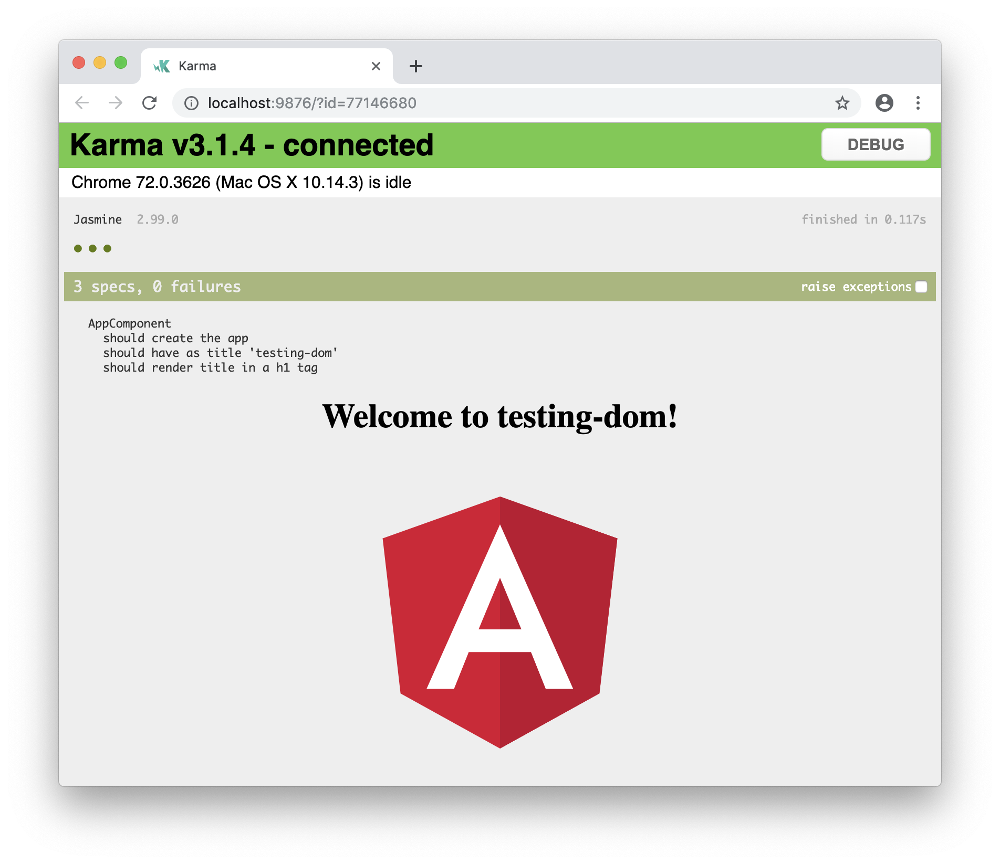

# Angular DOM Testing

This article is about Angular DOM Testing. You might have read [Angular Unit Testing][1] before. Well, this text will be similar. But except of using the tools of Angular testing package we will use the [Angular Testing Library][1] instead. This testing library is an Angular adapter around [DOM Testing Library][2]. 

Why DOM Test? Well, the Document Object Model is that what the source code makes. At the end it is all about manipulating the DOM and the DOM is that what the user access through the browser. DOM testing is about to test your app the same way as your users. Tests only break when you app breaks. Or as you can read on the official website "The more your tests resemble the way your software is used, the more confidence they can give you.". DOM Testing encourage good testing practices.

For this lecture we create a brand new Angular app with the command line interface (CLI) of Angular. Run the CLI command `ng new` and provide some name like `testing-dom`.

```console
ng new testing-dom
```

If we're at the command line we can install the Angular Testing Library using `npm` in our project folder.

```console
cd testing-dom
npm install --save-dev @angular-extensions/testing-library
```

So we change the directory to our project folder and install the library for development purpose with `--save-dev`. As you might know already your new app comes with some Unit Tests included. Take a look at the source files you will see the test file called `app.component.spec.ts`. We want to use this file to write our first tests the DOM Testing way.

```typescript
import { TestBed, async } from '@angular/core/testing';
import { AppComponent } from './app.component';

describe('AppComponent', () => {
    beforeEach(async(() => {
        TestBed.configureTestingModule({
        declarations: [
            AppComponent
        ],
        }).compileComponents();
    }));

    it('should create the app', () => {
        const fixture = TestBed.createComponent(AppComponent);
        const app = fixture.debugElement.componentInstance;
        expect(app).toBeTruthy();
    });

    it(`should have as title 'testing-dom'`, () => {
        const fixture = TestBed.createComponent(AppComponent);
        const app = fixture.debugElement.componentInstance;
        expect(app.title).toEqual('testing-dom');
    });

    it('should render title in a h1 tag', () => {
        const fixture = TestBed.createComponent(AppComponent);
        fixture.detectChanges();
        const compiled = fixture.debugElement.nativeElement;
        expect(compiled.querySelector('h1').textContent).toContain('Welcome to testing-dom!');
    });
});
```

This test is based on the Angular core testing tools, which we want to replace.

Replace 

```typescript
import { TestBed, async } from '@angular/core/testing';
```

with

```typescript
import { createComponent } from '@angular-extensions/testing-library';
```

Now we can use the new tools. The `beforeEach()` function can be deleted. We want to rewrite test by test.

```typescript
// old
// it('should create the app', () => {
//     const fixture = TestBed.createComponent(AppComponent);
//     const app = fixture.debugElement.componentInstance;
//     expect(app).toBeTruthy();
// });

// new
it(`should create the app`, async () => {
    const { container } = await createComponent('<app-root></app-root>', {
        declarations: [AppComponent],
    });
    expect(container).toBeTruthy();
});
```


```typescript
// old
// it(`should have as title 'testing-dom'`, () => {
//     const fixture = TestBed.createComponent(AppComponent);
//     const app = fixture.debugElement.componentInstance;
//     expect(app.title).toEqual('testing-dom');
// });

// new
it(`should have as title 'testing-dom'`, async () => {
    const { getByText } = await createComponent('<app-root></app-root>', {
        declarations: [AppComponent],
    });
    expect(getByText('Welcome to testing-dom!')).toBeDefined();
});
```

```typescript
// old
// it('should render title in a h1 tag', () => {
//     const fixture = TestBed.createComponent(AppComponent);
//     fixture.detectChanges();
//     const compiled = fixture.debugElement.nativeElement;
//     expect(compiled.querySelector('h1').textContent).toContain('Welcome to testing-dom!');
// });

// new
it(`should render title in a h1 tag`, async () => {
    const { container } = await createComponent({
        component: AppComponent,
    }, {
        declarations: [AppComponent],
    }, );
    expect(container.querySelector('h1').textContent).toContain('Welcome to testing-app!');
});
```

Take a look to our test to testing the DOM of our Angular app.

```typescript
import { createComponent } from '@angular-extensions/testing-library';
import { AppComponent } from './app.component';

describe('AppComponent', () => {

    it(`should create the app`, async () => {
        const { container } = await createComponent('<app-root></app-root>', {
            declarations: [AppComponent],
        });
        expect(container).toBeTruthy();
    });

    it(`should have as title 'testing-app'`, async () => {
        const { getByText } = await createComponent('<app-root></app-root>', {
            declarations: [AppComponent],
        });
        expect(getByText('Welcome to testing-app!')).toBeDefined();
    });

    it(`should render title in a h1 tag`, async () => {
        const { container } = await createComponent({
            component: AppComponent,
        }, {
            declarations: [AppComponent],
        }, );
        expect(container.querySelector('h1').textContent).toContain('Welcome to testing-app!');
    });

});
```

Running `ng test` should give us 3 SUCCESSful tests.




---

## Sources

[Angular Unit Testing][0]  
[Angular Testing Library][1]  
[DOM Testing Library][2]  

[0]: angular-unit-testing.md "Angular Unit Testing"  
[1]: https://testing-library.com/angular "Angular Testing Library"  
[2]: https://testing-library.com/ "DOM Testing Library"  


