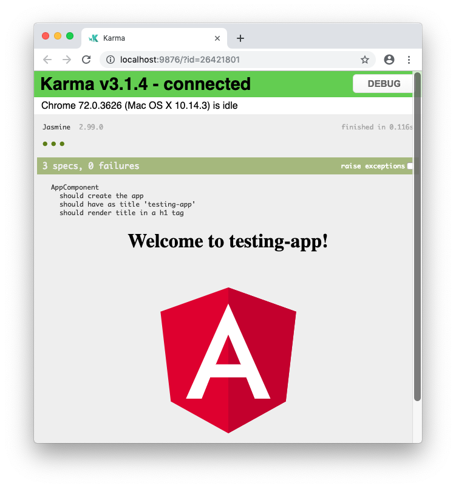
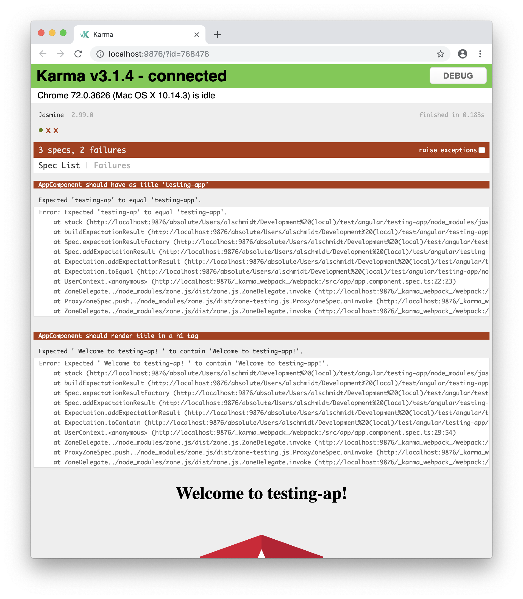
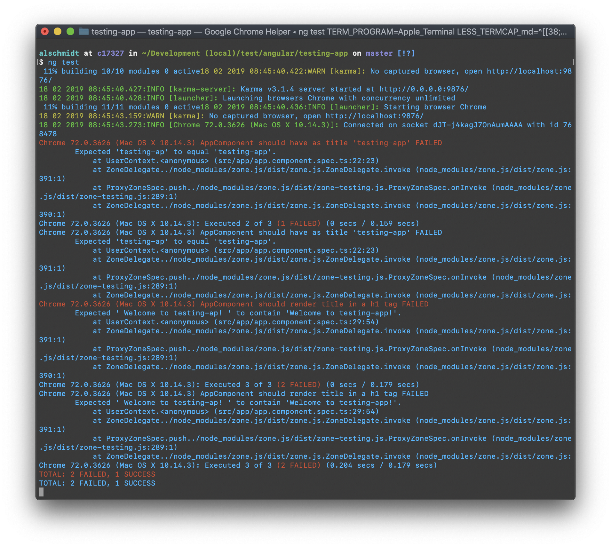

# Angular Unit Testing

This article is about Angular Unit Testing and not Testing at all. It will give you some example tests to introduce you in testing in Angular. After this it is about you to dive deeper in it.

Why Unit Test? Guess you have created a new Angular app and want to know if your components, pipes and services work as intended. The answer will give you Unit Tests. Writing the correct test to get the correct answer will be an important part. But keep in mind, this article cannot cover up all cases. Unit Testing is an extensive topic by his own. The goal of this article is to show you how to use Unit Testing in Angular apps and not philosophize about how tests should be written.

Unit Tests allow us to guard against breaking changes. Once written we can use them to run as often as we needed. When we update our app and a test fails, we know exactly where in our app is the failure. We can also analyse code behaviour for expected and unexpected results and we can reveal design mistakes. Maybe when we writing our test we come to a mistake in design of our app. Tests can help us.

## Introduction

For this lecture we create a brand new Angular app with the command line interface (CLI) of Angular. Run the CLI command `ng new` and provide some name like `testing-app`, as shown here:

```console
ng new testing-app
```

Your new app comes with some Unit Tests included. Take a look at the source files you will see the test file called `app.component.spec.ts`. The suffix `...spec.ts` is reserved for the test files and will come with every new component you create through console. Open in the editor it should look like that.

```typescript
import { TestBed, async } from '@angular/core/testing';
import { AppComponent } from './app.component';

describe('AppComponent', () => {
    beforeEach(async(() => {
        TestBed.configureTestingModule({
        declarations: [
            AppComponent
        ],
        }).compileComponents();
    }));

    it('should create the app', () => {
        const fixture = TestBed.createComponent(AppComponent);
        const app = fixture.debugElement.componentInstance;
        expect(app).toBeTruthy();
    });

    it(`should have as title 'testing-app'`, () => {
        const fixture = TestBed.createComponent(AppComponent);
        const app = fixture.debugElement.componentInstance;
        expect(app.title).toEqual('testing-app');
    });

    it('should render title in a h1 tag', () => {
        const fixture = TestBed.createComponent(AppComponent);
        fixture.detectChanges();
        const compiled = fixture.debugElement.nativeElement;
        expect(compiled.querySelector('h1').textContent).toContain('Welcome to testing-app!');
    });
});
```

You see three `it` blocks here. Every block is a test. The `beforeEach` function will be executed - you guess it - before each test. But, well, let's get into it line by line. 

```typescript
import { TestBed, async } from '@angular/core/testing';
import { AppComponent } from './app.component';

describe('AppComponent', () => {
```

At the top we `import` two tools from the Angular core testing package: `TestBed` and `async`. This tools we need to set up our testing environment. Then we `describe` the testing unit, which is our app component in this case. We then have a closure `() => {` for the `describe` function. Everything in there will be executed by the test runner Angular comes with: [Karma][1]. 

```typescript
beforeEach(async(() => {
    TestBed.configureTestingModule({
    declarations: [
        AppComponent
    ],
    }).compileComponents();
}));
```

Then the `beforeEach` function will execute some code before each test. Keep in mind, that every test (`it` block) will be run totally independent by the test before, even if they are written down one after another. So the second block is not be influenced by the first block and vice versa. In the `beforeEach` block we configure a testing module as a method on the [`TestBed`][8]. `TestBed` is the Angular main testing object. This allow us to configure the module for our testing. Then we simply declare our component we want to have for this testing environment: `AppComponent`. This declaration looks like the one in the file `app.module.ts` without the `imports`, `providers` and `bootstrap`. That make sense, because we don't want to run the app in the browser. We only want to focus at the component for testing. The rest will be simulated by the testing environment.

```typescript
it('should create the app', () => {
    const fixture = TestBed.createComponent(AppComponent);
    const app = fixture.debugElement.componentInstance;
    expect(app).toBeTruthy();
});
```

Then we get a couple of tests. The first one here checks if the app is already created. We always need to create the component in every `it` block for encapsulated testing. This will done by `TestBed` in the `fixture` variable. Then we can get our app by `fixture`, which holds our created component. With the `debugElement` we look at the `componentInstance`, which was created and which is our component at the end. We always end a `it` block by using the `expect` method. The `it` and `expect` are both Jasmine packages. So, at last of our first test we `expect` our `app` `toBeTruthy`, which means somehow existent.

```typescript
it(`should have as title 'testing-app'`, () => {
    const fixture = TestBed.createComponent(AppComponent);
    const app = fixture.debugElement.componentInstance;
    expect(app.title).toEqual('testing-app');
});
```

In the next block we check it `should have as title 'testing-app'`, because this is the setup in the `app.component.ts`, where we get the title property, which will be output in the file `app.component.html` with string interpolation. So it should have the title. We create the component, we get access to the instance and then we expect that the app get this title property which equals `testing-app`. This is only true as long we don't change or remove the title. That is how you write your tests. You have to reflect your actual application.

```typescript
it('should render title in a h1 tag', () => {
    const fixture = TestBed.createComponent(AppComponent);
    fixture.detectChanges();
    const compiled = fixture.debugElement.nativeElement;
    expect(compiled.querySelector('h1').textContent).toContain('Welcome to testing-app!');
});
```

Finally we check `should render title in a h1 tag`. We create the component again and then we call `detectChanges` to trigger change detection. That is the only way to do it, since it runs automatically and not in the browser. With this the template gets rendered. Then with the `debugElement` we look at the `nativeElement` and expect in the compiled template a `h1` tag, which contains the string `Welcome to testing-app!`.

Now, to see [Karma][1] and [Jasmine][2] in Action just open a terminal again and run the tests.

```console
ng test
```

A chrome browser will be opened automatically and displays the test results and the app itself.



Well. This looks good. Now change something, for example the title in the file `app.component.ts` and see, how the tests goes when something is going wrong.



Even in the terminal you see the debug information.



The error messages gives you some helpful information to fix the bug. In our case the unexpected title gives us two errors. The second and third test of our `app.component.spec.ts` fail. The title isn't `testing-app` any more. Fixing the title and rerun the test gives us certainty about the flaw of our app.

---

## Testing components

Let's dive a little bit deeper into testing. Just create a new component, for example a user component, in the console.

```console
ng g c user
```

We know `g` stands for 'generate' and `c` for 'component'. Our template in `user.component.html` in the folder `app/user` should contain something like this.
```html
<div *ngIf="isLoggedIn">
    <h1>User logged in</h1>
    <p>User is: {{ user.name }}</p>
</div>
<div *ngIf="!isLoggedIn">
    <h1>User not logged in</h1>
    <p>Please log in first</p>
</div>
```

Here are two div blocks, which will be displayed if the user is logged in or not. If it is true, he should see the name of the user. The variable `isLoggedIn` is to declare in our component, in the file `user.component.ts`, as well as our user object, which contains the name. Our component should be like this.

```typescript
import { Component, OnInit } from '@angular/core';

@Component({
    selector: 'app-user',
    templateUrl: './user.component.html',
    styleUrls: ['./user.component.css']
})
export class UserComponent implements OnInit {
    user: {name: string};
    isLoggedIn = false;

    constructor() { }

    ngOnInit() {
    }
}
```

Let's have a look at the file `app.modules.ts` if our `UserComponent` is imported and declared the right way. It should be all fine while it is generated through the console. Now, let's see what our spec file of `UserComponent` contains, which is already created.

```typescript
import { async, ComponentFixture, TestBed } from '@angular/core/testing';
import { UserComponent } from './user.component';

describe('UserComponent', () => {
    let component: UserComponent;
    let fixture: ComponentFixture<UserComponent>;

    beforeEach(async(() => {
        TestBed.configureTestingModule({
            declarations: [ UserComponent ]
        })
        .compileComponents();
    }));

    beforeEach(() => {
        fixture = TestBed.createComponent(UserComponent);
        component = fixture.componentInstance;
        fixture.detectChanges();
    });

    it('should create', () => {
        expect(component).toBeTruthy();
    });
});
```

Line by line.

```typescript
import { async, ComponentFixture, TestBed } from '@angular/core/testing';
import { UserComponent } from './user.component';

describe('UserComponent', () => {
```

We `import` what we need to run the test of `UserComponent`. Then we `describe` our test. 

```typescript
beforeEach(async(() => {
    TestBed.configureTestingModule({
        declarations: [ UserComponent ]
    })
    .compileComponents();
}));
```

In the first `beforeEach()` method we declare our module again. `TestBed` is the main testing object, which gives us access to all the testing utilities for configuring the Angular app. The call of `configureTestingModule` expect an JavaScript object where you declare the objects like in `@NgModule`, in this case `UserComponent`. If you are not using the CLI or any other [webpack][9] based setup you need to `compileComponents` after.

```typescript
beforeEach(() => {
    fixture = TestBed.createComponent(UserComponent);
    component = fixture.componentInstance;
    fixture.detectChanges();
});
```

In the next `beforeEach()` method we created the fixture again, where we use the `TestBed` to `createComponent` and in this case the `UserComponent`. Now we created this component in our testing environment. With the `fixture` you get your `component` and you do this with the access to your `componentInstance`. This is your component running one instance. You should tell `TestBed` to perform data binding by calling `fixture.detectChanges()` to detect updates from our app. Both `beforeEach()` methods run for each test.

```typescript
it('should create', () => {
    expect(component).toBeTruthy();
});
```

Actually we can write the test. We `expect` the `component` `toBeTruthy`. This just checks if it exists. See if it works by starting the test in the console with `ng test`. You should see TOTAL 4 SUCCESS executed tests. It worked. This was a very simple test.

---

## Testing services and injections

So far so simple. Let's spice it up and add and test some service for our user. Create a file `user.service.ts` in the folder `user`. 

```typescript
export class UserService {
    user = {
        name: 'Alex'
    };
}
```

In this file you export your `UserService` class and in this class you will have a `user` object which you can retrieve from your component. It only contains one `name`. A very very simple service which should be imported in our `user.component.ts`.

```typescript
import { UserService } from './user.service';
import { Component, OnInit } from '@angular/core';

@Component({
    selector: 'app-user',
    templateUrl: './user.component.html',
    styleUrls: ['./user.component.css'],
    providers: [UserService]
})
export class UserComponent implements OnInit {
    user: {name: string};
    isLoggedIn = false;

    constructor(private userService: UserService) { }

    ngOnInit() {
        this.user = this.userService.user;
    }
}
```

In the component we `import` the `UserService` and count it to the `providers` in the `@Component()` decorator. In our constructor we inject our service with `private userService:` of type `UserService`. Then you can say `ngOnInit()` `this.user` is equal `this.userService.user`. This happens synchronously but we inject something. This is how we bring the app to work. But how should bring we the test to work? We want to get the user name from the service. So let's create a new test for that. Just open the file `user.component.spec.ts` again.

```typescript
it('should display the user name if user is logged in', () => {
    component.isLoggedIn = true;
    fixture.detectChanges();
    const compiled = fixture.debugElement.nativeElement;
    expect(compiled.querySelector('p').textContent).toContain(component.user.name);
});
```

With `it` we start and describe our test. In our `component` (declared in the second `beforeEach()`) we checked if `isLoggedIn` is `true`. To detect the changes in our app we call `fixture.detectChanges()` again. After that we declare a constant for our `compiled` app, because we don't start the app in the browser and therefore the browser don't take the job to compile our app. This we will get get through one `fixture.debugElement` called `nativeElement`. Last we `expect` - and here we should take a look into our component template - in the `compiled` app that a paragraphs (`querySelector('p')`) `textContent` contains the `component.user.name`. Let's do a similar test for the opposite.

```typescript
it('should\'t display the user name if user is not logged in', () => {
    component.isLoggedIn = false;
    fixture.detectChanges();
    const compiled = fixture.debugElement.nativeElement;
    expect(compiled.querySelector('p').textContent).not.toContain(component.user.name);
});
```

This test is almost equal to the test above, accept of the state, that if the user is not logged in, the name should not displayed. Do you see the difference? Sure `component.isLoggedIn` should be `false` and last we expect `not.toContain` his name in a paragraph. Rerun the test with `ng test` should now give us 7 SUCCESSful tests.

---

## Testing async

So far we tested synchronous. What if we want to test asynchronous services which we might have in our app with some external web services? For this scenario create a new folder called `shared` in our `app` directory and in there a file called `data.service.ts`. This service will expose a asynchronous function we want to test.

```typescript
export class DataService {
    getDetails() {
        const resultPromise = new Promise((resolve, reject) => {
            setTimeout(() => {
                resolve('Data');
            }, 1500);
        });
        return resultPromise;
    }
}
```

We `export` a `class` `DataService` and this will have a `getDetails()` method, which will have a promise, the `resultPromise`. This will be a `new Promise()` where we pass `resolve` and `reject` as arguments for the callback repassing to the promise constructor `() => {}`. Then we basicly `setTimeout()` to one and a half second `1500` and execute another function where we simply `resolve('Data')`, pass back a string holding `Data`. Outside of this promise we `return resultPromise`. Before testing we use the new service in our `user.component.ts`.

```typescript
import { UserService } from './user.service';
import { DataService } from '../shared/data.service';
import { Component, OnInit } from '@angular/core';

@Component({
    selector: 'app-user',
    templateUrl: './user.component.html',
    styleUrls: ['./user.component.css'],
    providers: [UserService, DataService]
})
export class UserComponent implements OnInit {
    user: {name: string};
    isLoggedIn = true;
    data: string;

    constructor(private userService: UserService, private dataService: DataService) { }

    ngOnInit() {
        this.user = this.userService.user;
    }
}
```

We `import` the `DataService` from `../shared/data.service` and provide it in the `@Component` decorator like the `UserService`. The we create a property called `data` of type `string`. In the `constructor` we want to inject this to get access to the instance of it. This we do with `private dataService: DataService`. Now we can write some tests. Get back to the file `user.component.spec.ts`.

```typescript
it('should\'t fetch data successfully if not called asynchronously', () => {
    const dataService = fixture.debugElement.injector.get(DataService);
    let spy = spyOn(dataService, 'getDetails').and.returnValue(Promise.resolve('Data'));
    fixture.detectChanges();
    expect(component.data).toBe(undefined);
});
```

First let's do a normal test if it shouldn't fetch data successfully if not called asynchronously. This is not a great test, because we are testing features of the testing packages and not of the app. But it will bring up the difference between this test and the next async test (see below). In this test we pass a function `() => {}` as a second parameter and inside this callback we want to get access to our `getDetails()` method, which happens asynchronously. The thing is, we don't necessarily want to execute the real `getDetails()` method, because this method might reach out to a server and in a real application we don't want to reach out to the server all the time when testing it. Instead we want to kind of fake it. We want to create a fake implementation which is still asynchronous but does provide some dummy data. 

Therefore we create a new variable `spy` and do something like `spyOn()`, which is given to us through the testing environment. It is not Angular specific. Inside we tell we want to spy on `dataService` and on the `getDetails()` method there. Then we chain something with `and` and `returnValue`. So we get informed when `getDetails()` gets executed and return a value on our own. The value we will return here is `Promise.resolve('Data')`. Then we run the change detection with `fixture.detectChanges()` after we got the data and check if that worked. So we `expect` our `component.data` `toBe` `undefined`. Normally we do expect some kind of `Data` but we know this will fail. Therefore we write another test.

The data we will get will be initialized in the file `user.component.ts` on init. Open the file and add this one line of code to `ngOnInit()`.

```typescript
this.dataService.getDetails().then((data: string) => this.data = data);
```

So it should be like this.

```typescript
ngOnInit() {
    this.user = this.userService.user;
    this.dataService.getDetails().then((data: string) => this.data = data);
}
```

Here we use our `dataService` to `getDetails()` and `then` - it is a promise - use the `data` of type `string` we get back to set `this.data` equal to the data we get back. Let's go back to our testing file `user.component.spec.ts`. Well, `undefined` is not what we expect at runtime. How can we test if a variable or a state changes during the runtime? 

```typescript
it('should fetch data successfully if not called asynchronously', async(() => {
    const dataService = fixture.debugElement.injector.get(DataService);
    let spy = spyOn(dataService, 'getDetails').and.returnValue(Promise.resolve('Data'));
    fixture.detectChanges();
    fixture.whenStable().then(() => {
        expect(component.data).toBe('Data');
    });
}));
```

This is copy of our test above. After the description (now it `should fetch` the data) we use the `async` function, which is imported with the `TestBed` from the Angular core testing packages, and wrap the callback function with the `async` function. So Angular is aware that here is an async test. The difference to above is that we use the `fixture` and execute `whenStable()`. This function allows us to react to all asynchronous test are finished. We can `then()` (`then` function of our promise) execute a callback with our `expect`, that the `component.data` should be `Data` in this case. This will happen when the asynchronous function has been finished. Save this and we get 9 SUCCESSful tests.

---

## Isolated Testing

Does the thing you want to test depends on Angular or other things of your application? If yes you can take the testing utilities like `TestBed`, `async`, `fakeAsync` or `tick` and so on learned in the lesson before. If you don't have any dependencies you can write isolated tests. Let's have an example with a simple pipe.

In your `shared` folder create a file named `reverse.pipe.ts`.

```typescript
import { Pipe, PipeTransform } from '@angular/core';

@Pipe({
    name: 'reverse'
})
export class ReversePipe implements PipeTransform {
    transform(value: string) {
        return value.split('').reverse().join('');
    }
}
```

This is a simple pipe which only needs `Pipe` and `PipeTransform` to be imported from the `@angular/core`. In the `@Pipe` decorator we `name` it `reverse` and then export the `class ReversePipe` which `implements PipeTransform`. What this pipe do is to `transform` a `value` of type `string` and `return` it, after it has taken the value, `split()` it in his single characters, `reverse()` it and `join()` it again, so each character is attached to the character before it without white space in between. Let's test it by creating a file `reverse.pipe.spec.ts` in the same `shared` folder.

```typescript
import { ReversePipe } from './reverse.pipe';

describe('ReversePipe', () => {
    it('should reverse', () => {
        const reversePipe = new ReversePipe();
        expect(reversePipe.transform('hello')).toEqual('olleh');
    });
});
```

The only thing we need to `import` is the `ReversePipe`. Therefore it is an isolated test. It doesn't need any other packages. Even it doesn't need Angular. After we `describe` the test `it` `should reverse` a string and for that we declare a `new ReversePipe()` and `expect` that this pipe `transform` the string `'hello'` `toEqual` `'olleh'`. Run the test and look if this is SUCCESSful.

---

## Sources

[Karma - Test Runner for JavaScript][1]  
[Jasmine - Behavior-Driven JavaScript][2]  
[Angular Testing (Official Documentation)][4]  
[Basic Introduction to Unit Testing in Angular Apps (Video Tutorial)][3]  
[Testing Components in Angular 2 with Jasmine][6]  
[Unit Tests with CLI][7]  
[Unit Tests (official Docs)][10]  
[webpack Concepts][9]

[1]: https://github.com/karma-runner/karma "Karma - Test Runner for JavaScript"
[2]: https://github.com/jasmine/jasmine.github.io "Jasmine - Behavior-Driven JavaScript" 
[3]: https://www.udemy.com/the-complete-guide-to-angular-2/learn/v4/t/lecture/5951176?start=0 "Basic Introduction to Unit Testing in Angular Apps (Video Tutorial)"
[4]: https://angular.io/guide/testing "Angular Testing (Official Documentation)"
[5]: https://toddmotto.com/angular-pipes-custom-pipes "Step by Step Custom Pipes in Angular"
[6]: https://semaphoreci.com/community/tutorials/testing-components-in-angular-2-with-jasmine "Testing Components in Angular 2 with Jasmine"
[7]: https://angular.io/cli/test "Unit Tests with CLI"
[8]: https://codecraft.tv/courses/angular/unit-testing/angular-test-bed/ "Angular Test Bed"  
[9]: https://webpack.js.org/concepts "webpack concepts"  
[10]: https://github.com/angular/angular-cli/wiki/test "Unit Tests (official Docs) "  
